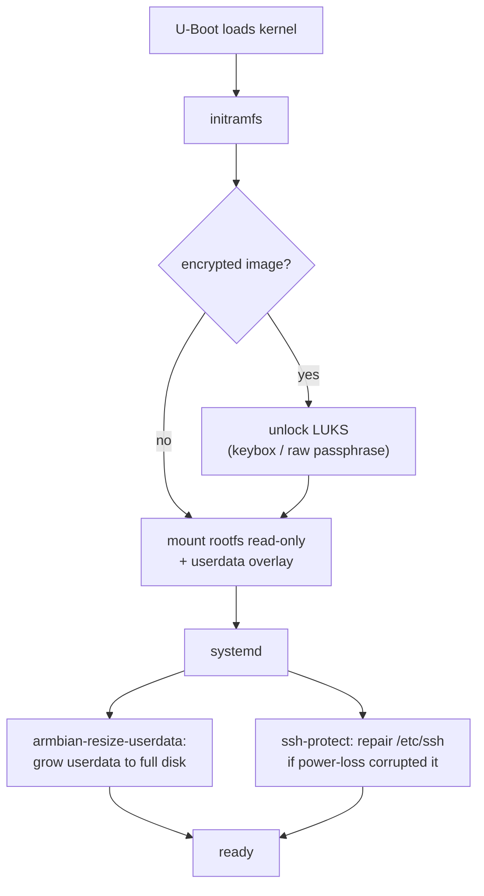

# 1. Getting Started

Goal of this chapter: from a clean machine to a flashed, booting image.

> **Skip the build?** CI-built images are published at
> [Seeed-Studio/armbian-build releases](https://github.com/Seeed-Studio/armbian-build/releases).
> Each release carries a download table per board (rk3576 / rk3588 /
> rk3576 module devkits):
> one row per distribution (Debian 13 / Ubuntu 26.04) × variant (Gnome /
> Minimal CLI) × type (**AB** / **RECOVERY**), with an **IMAGE** link
> (`.img.xz`, flash-ready GPT) and an **OTA** link (update payload for the
> paired image) per row. The matching `.sha256` sidecar sits next to each
> file on OneDrive — verify after downloading. The pre-release is recreated
> on every CI run, so always take the newest one. Flash it with
> [§5 Flash and boot](#5-flash-and-boot); read on only if you need to build
> your own image.

1. [Prerequisites](#1-prerequisites)
2. [Get the trees](#2-get-the-trees)
3. [Stage the build wrapper](#3-stage-the-build-wrapper)
4. [Your first build](#4-your-first-build)
5. [Flash and boot](#5-flash-and-boot)
6. [Next steps](#6-next-steps)

## 1. Prerequisites

- Linux build host (Ubuntu 22.04/24.04 work well), ~50 GB free disk.
- Docker installed and usable without sudo (the build runs in a container).
- Baseline knowledge: [Armbian build system](https://docs.armbian.com/Developer-Guide_Build-Preparation/).
- No serial cable required for normal use, but it is the best debugging tool
  when a board does not boot — recommended.

If your host has a global HTTP proxy, expect build failures in chroot/APT.
The examples below unset proxies and pass `APT_PROXY_ADDR=none`.

## 2. Get the trees

The extension is consumed by the Armbian build. Clone both:

```bash
mkdir -p ~/armbian && cd ~/armbian
git clone https://github.com/armbian/build.git          # Armbian build tree
cd build
mkdir -p userextensions
git clone https://github.com/Seeed-Studio/seeed_armbian_extension.git \
    userextensions/seeed_armbian_extension
```

> The extension is enabled with `ENABLE_EXTENSIONS=seeed_armbian_extension`
> (set automatically by the wrapper in the next step).

## 3. Stage the build wrapper

[`scripts/build.sh`](../scripts/build.sh) is the single entry point for all
profiles. It **must sit next to `compile.sh`** in the build tree root — it
refuses to run anywhere else:

```bash
cp userextensions/seeed_armbian_extension/scripts/build.sh .
./build.sh -h    # usage
```

Why staging: the wrapper drives `./compile.sh` in the same directory and
manages caches relative to the build tree. CI does exactly the same copy step.

## 4. Your first build

The simplest useful image — Recovery OTA, plain (unencrypted), rk3576 devkit:

```bash
./build.sh recovery -b recomputer-rk3576-devkit
```

What happens: the wrapper resolves the profile into environment variables
(`OTA_ENABLE=yes` …), runs `compile.sh` in Docker, and produces under
`output/`:

| Artifact | Path | Purpose |
|---|---|---|
| image | `output/images/Armbian_*.img.xz` | flash-ready GPT, stock name (no `_RECOVERY` suffix) |
| OTA package | `output/images/<BOARD>/ota/*_OTA.tar.gz` | update payload for the image above |
| checksums | `<artifact>.sha256` / `<image>_OTA.checksums` | verify downloads |
| U-Boot deb | `output/debs/linux-u-boot-<board>-<branch>[-secure]_*.deb` | signed loaders for hand-flashing (secure-boot builds, [06 §2](06-secure-boot.md)) |

Logs land in `output/logs/`. First run downloads toolchains/sources and can
take an hour or more; subsequent builds reuse the cache
([02 §6](02-build-reference.md#6-caches-and-rebuild-cost)).

**Verification checkpoint** — the build log ends with the image path and no
`error` lines:

```bash
ls -lh output/images/
```

Variants you will use most (all combinations of profile + board):

```bash
./build.sh recovery -b recomputer-rk3588-devkit   # rk3588 variant
./build.sh ab -b recomputer-rk3576-devkit         # A/B instead of Recovery
./build.sh recovery --minimal -b recomputer-rk3576-devkit   # CLI, no desktop
```

Encrypted/signed builds need a passphrase — see
[05-encryption.md](05-encryption.md) before attempting them.

The full option/variable reference is [02-build-reference.md](02-build-reference.md).

## 5. Flash and boot

Verify the download first, then flash the complete GPT image with your
usual Rockchip tooling — no partition math required:

```bash
sha256sum -c Armbian_*.img.xz.sha256          # verify
xzcat Armbian_*.img.xz | sudo dd of=<target-disk> bs=4M conv=fsync status=progress
```

Maskrom path: hold the board's recovery button while powering on, attach
it to a host running RKDevTool, and write the image with the Maskrom
loader. Signed builds additionally ship
[`spl_loader_maskrom.bin`](06-secure-boot.md#2-build-a-secure-boot-image)
for exactly this flow.

**First boot on device:**



After login (Armbian default credentials of your release — change them):

- runtime writes persist on `userdata`; the rootfs stays read-only
  ([why](03-ota-recovery.md#why-updates-keep-your-data));
- SSH is **disabled by default** — enable it after first local login with
  `sudo systemctl enable --now ssh` ([08-hardening.md](08-hardening.md));
- encrypted images silently migrated the passphrase into OP-TEE on this
  boot ([05 §3](05-encryption.md#3-where-the-secret-lives)).

Verify the OTA runtime is present (**on device**):

```bash
armbian-ota status    # prints mode + status; "unknown" before any OTA is fine
```

## 6. Next steps

- Deliver updates: [03-ota-recovery.md](03-ota-recovery.md)
- Or switch to rollback-safe dual-slot firmware: [04-ota-ab.md](04-ota-ab.md)
- Need confidentiality or a signed bootchain? [05-encryption.md](05-encryption.md) / [06-secure-boot.md](06-secure-boot.md)
- What every image already protects against: [08-hardening.md](08-hardening.md)
