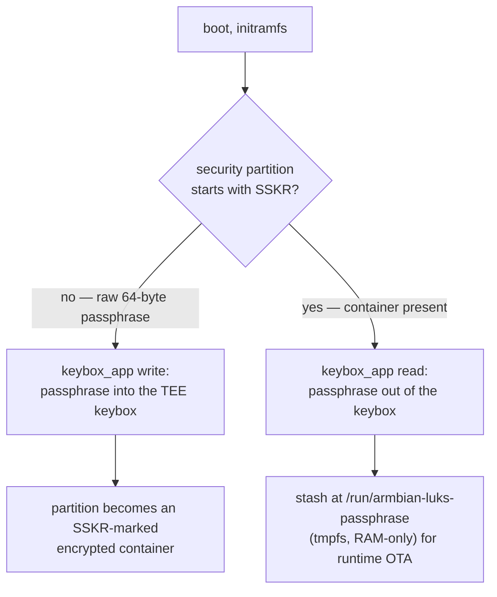

# 5. Disk Encryption (LUKS + Automatic Unlock)

For devices whose disk leaves your control (deployed products, RMA returns,
resale): the rootfs and userdata partitions are LUKS-encrypted, and the
device unlocks itself at boot — no operator, no password prompt. Possession
of the passphrase equals possession of the data; there is deliberately no
"login" step.

1. [Choose the tier](#1-choose-the-tier)
2. [Build an encrypted image](#2-build-an-encrypted-image)
3. [Where the secret lives](#3-where-the-secret-lives)
4. [What happens at boot](#4-what-happens-at-boot)
5. [Rules and pitfalls](#5-rules-and-pitfalls)

## 1. Choose the tier

| Tier | Flag | What you get |
|---|---|---|
| plain | — | no encryption |
| secure-rootfs | `RK_OPTEE_BOOT_ENABLE=yes` | LUKS everywhere + automatic unlock + OP-TEE bootchain (BL32), unsigned |
| secure-boot | `RK_SECURE_UBOOT_ENABLE=yes` | all of the above **plus** a signed bootchain — see [06-secure-boot.md](06-secure-boot.md) |

The two secure flags are mutually exclusive and both auto-enable
`CRYPTROOT_ENABLE` + `RK_AUTO_DECRYP` (rules enforced in
[`seeed_armbian_extension.sh`](../seeed_armbian_extension.sh)). With the
wrapper you select them via the `secure-rootfs` / `secure-boot` profiles —
you never set the raw flags yourself.

## 2. Build an encrypted image

```bash
CRYPTROOT_PASSPHRASE='<exactly-64-characters>' \
./build.sh ab secure-rootfs -b recomputer-rk3576-devkit
```

Generate and store one before your first encrypted build:

```bash
openssl rand -base64 48    # 48 random bytes -> exactly 64 characters
```

**Why exactly 64 characters:** the build only checks the passphrase is
non-empty ([`build.sh:153`](../scripts/build.sh#L153)); the initramfs later
raw-reads **64 bytes** from the security partition
([`decryption-disk.sh`](../rk_secure-disk-encryption/initramfs/decryption-disk.sh)).
A longer passphrase is silently truncated at unlock — the device would run
fine, but you no longer know the effective secret. 64 chars, stored safely
(password manager), once per product line is the sane default.

> [!IMPORTANT]
> Losing the passphrase loses the data — by design. It is also the OTA
> payload key, so the same passphrase must be used when building updates for
> a fleet flashed with it.

## 3. Where the secret lives

One passphrase, three build-time consumers:

```text
CRYPTROOT_PASSPHRASE ──┬── LUKS headers (rootfs, userdata, both A/B slots)
                      ├── security partition (raw 64B, first-boot copy)
                      └── HKDF-SHA256 ──> AES key for OTA payload encryption
```

- The 4 MiB `security` partition ([`OTA_SECURITY_SIZE`](../armbian-ota/common/build-hooks/partitions.sh#L32))
  initially holds the raw passphrase, written and read-back-verified at
  image build.
- On the **first boot** the initramfs migrates it into OP-TEE secure storage
  (SSKR keybox, handled by a trusted app on the SoC); the partition then
  carries an `SSKR` marker instead of plaintext.
- On every later boot the passphrase is read back from OP-TEE; a tmpfs copy
  at `/run/armbian-luks-passphrase` (mode 600, gone on power loss) feeds
  runtime OTA key derivation.

### Where the keybox physically lives



- The keybox TA (Rockchip `rk_tee_user`, from the
  [`rockchip_sdk_tools`](../rk_secure-disk-encryption/build-hooks/common.sh#L10)
  fork) stores the passphrase as an encrypted persistent object. Our
  scripts select the REE-FS backend (`SECURITY_STORAGE=SECURITY`,
  [`decryption-disk.sh:5`](../rk_secure-disk-encryption/initramfs/decryption-disk.sh#L5)):
  the ciphertext lands **on the security partition itself** as the
  `SSKR`-marked container, wrapped with keys derived from the SoC. The
  eMMC-only RPMB backend exists in the app but is never selected here.
- Reads are gated inside the TA: a caller must first complete an
  RNG-then-hash handshake; one that skips it receives hardware-random
  bytes, never the stored key.
- The OP-TEE stack reaches the partition through
  `/dev/block/by-name/security` — a path mainline Armbian does not
  provide, so the initramfs creates the symlink itself
  ([`decryption-disk.sh:209`](../rk_secure-disk-encryption/initramfs/decryption-disk.sh#L209)).
  After `switch_root` the path is gone; with no eMMC RPMB to fall back
  on, NVMe boards cannot re-read the keybox from the running system —
  which is why the passphrase is handed to userspace via `/run`.

### How the OTA payload is encrypted

The AES key never ships in the package — both sides derive it
independently from the passphrase
([`package-create.sh`](../armbian-ota/common/build-hooks/package-create.sh) /
[`common.sh`](../armbian-ota/common/rootfs/usr/share/armbian-ota/common.sh)):

| | Build host | Device |
|---|---|---|
| Key | HKDF-SHA256(passphrase, info `armbian-ota-payload-v1`) → 32-byte AES-256 key | same derivation → same key |
| Payload | `rootfs.tar.gz` → AES-256-CBC → `rootfs.tar.gz.enc` (random IV, plaintext deleted) | verify `payload.manifest` signature (when present) → decrypt → re-check SHA256 |

Encryption keeps the payload confidential in transit; the RSA-PSS manifest
signature (secure-boot builds only — it reuses the FIT signing key,
[06-secure-boot.md](06-secure-boot.md)) proves it was not tampered with.

**TrustZone in one paragraph:** OP-TEE is a tiny secure OS running in the
SoC's isolated TrustZone world (BL32, booted alongside ATF). The keybox
lives inside it, reachable only through `keybox_app` over `/dev/tee0`
([`install-optee`](../rk_secure-disk-encryption/initramfs/install-optee));
its physical storage is the SSKR container described above.

## 4. What happens at boot

[`initramfs/decryption-disk.sh`](../rk_secure-disk-encryption/initramfs/decryption-disk.sh),
in order:

1. Anchor to the disk U-Boot booted from (`armbian.bootdev` tokens) — with
   several disks attached, root is only ever taken from the boot disk; a
   cloned/foreign disk cannot capture the unlock.
2. Read the passphrase: `SSKR` marker → OP-TEE keybox via `keybox_app`
   (failure is fatal); no marker yet → raw 64 bytes + opportunistic
   migration into the keybox.
3. `cryptsetup luksOpen` the root as `/dev/mapper/armbian-root`
   (A/B: the slot named by `armbian.slot=a|b`), and userdata as
   `armbian-userdata` (backs the overlay upper layer).
4. Boot continues into the unlocked, overlayed system.

If anything in this chain fails the boot stops in initramfs — an encrypted
device never falls back to booting from some other disk.

## 5. Rules and pitfalls

- **One passphrase per fleet.** OTA packages are encrypted with a key derived
  from it; devices flashed with passphrase A reject packages built with
  passphrase B (the `OTA_ENCRYPTED` cross-check catches mismatches).
- **No SSH unlock.** Auto-decrypt forces `CRYPTROOT_SSH_UNLOCK=no` — one
  unlock path, no side channel.
- **Cloned disks are inert.** Copying an encrypted disk gives you ciphertext
  plus a keybox bound to the original SoC's secure storage; on another board
  the unlock chain fails.
- **Recovery after forgetting the passphrase:** none. Reflash.
- What this protects: data at rest on a removed disk, tampered update
  payloads (on secure-boot). What it does not: an attacker with the running
  system or the passphrase.

Next: a signed bootchain on top — [06-secure-boot.md](06-secure-boot.md).
