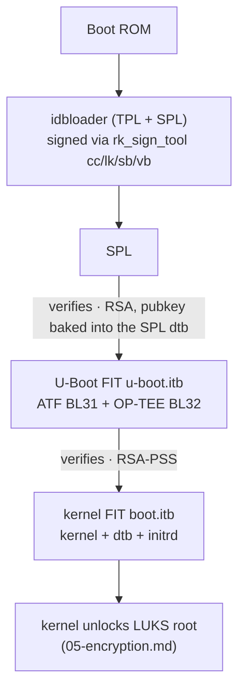

# 6. Secure Boot (Signed Rockchip Bootchain)

On top of [encryption](05-encryption.md), the `secure-boot` tier signs the
whole boot path: if any piece is replaced, the board refuses to boot it. This
defends the device against persistent bootchain implants on hardware an
attacker can physically touch.

1. [What gets signed](#1-what-gets-signed)
2. [Build a secure-boot image](#2-build-a-secure-boot-image)
3. [Signing keys: keep them or regenerate them](#3-signing-keys-keep-them-or-regenerate-them)
4. [The mkimage PSS salt pitfall](#4-the-mkimage-pss-salt-pitfall)
5. [Device-tree overlays on secure-boot images](#5-device-tree-overlays-on-secure-boot-images)
6. [Updates on a signed system](#6-updates-on-a-signed-system)
7. [Trust boundary, and scaling it up](#7-trust-boundary-and-scaling-it-up)

## 1. What gets signed



- The public key is embedded into the SPL device tree at build time — the
  SPL is the root of trust; everything above it is verified at each hop.
- The kernel FIT lives on a **raw boot partition** (no ext4): secure-boot
  images have no `/boot` filesystem at all, so nothing on it can be quietly
  edited at runtime.
- Build-time implementation:
  [`secure-boot-uboot.sh`](../rk_secure-disk-encryption/build-hooks/secure-boot-uboot.sh)
  (U-Boot FIT + loader signing) and
  [`secure-boot-image.sh`](../rk_secure-disk-encryption/build-hooks/secure-boot-image.sh)
  (kernel FIT + raw boot flash); ITS templates per SoC under
  [`u-boot/fit-kernel/`](../rk_secure-disk-encryption/u-boot/fit-kernel).

## 2. Build a secure-boot image

```bash
CRYPTROOT_PASSPHRASE='<64-char-passphrase>' \
./build.sh recovery secure-boot -b recomputer-rk3576-devkit
```

This turns on: LUKS + automatic unlock + signed bootchain + Maskrom usbplug
build (`RK_COMPILE_USBPLUG`, opt out with `--no-usbplug`). The build fails if
any signature step does not verify — a signed image that boots is already
proof the chain is intact (build-time `fit_check_sign` gate).

Every secure-boot build also emits the signed U-Boot as a standalone deb in
`output/debs/linux-u-boot-<board>-<branch>-secure_*.deb` — the `-secure`
suffix gives it a package namespace of its own, apart from the unsigned
build ([`uboot-package-name.sh`](../rk_secure-disk-encryption/build-hooks/uboot-package-name.sh)).
To flash the signed U-Boot by hand (e.g. Maskrom recovery with RKDevTool),
unpack it:

```bash
dpkg -x output/debs/linux-u-boot-*-secure_*.deb uboot-secure
ls uboot-secure/usr/lib/linux-u-boot-*/
# idbloader.img  u-boot.itb  rkspi_loader.img  spl_loader_maskrom.bin
```

`./build.sh --uboot secure-boot` rebuilds only this deb — keep
`UBOOT_FIT_KEYS_BACKUP_DIR` pointed at the fleet keys
([§3](#3-signing-keys-keep-them-or-regenerate-them)).

On a **running device** the same deb can update the loaders in place:

```bash
# 1) install (places the artifacts under /usr/lib/linux-u-boot-*/)
sudo apt install ./linux-u-boot-<board>-<branch>-secure_*.deb

# 2) write idbloader + u-boot.itb to the boot disk (postinst writes only
#    when asked to):
sudo FORCE_UBOOT_UPDATE=yes apt install --reinstall ./linux-u-boot-<board>-<branch>-secure_*.deb

# 3) SPI-boot boards — flash the SPI loader to match:
sudo bash -c 'source /usr/lib/u-boot/platform_install.sh && \
  write_uboot_platform_mtd /usr/lib/linux-u-boot-<branch>-<board> /dev/mtd0'
```

Step 3 does exactly what Armbian's SPI install does — the deb's own
`/usr/lib/u-boot/platform_install.sh` provides
`write_uboot_platform_mtd`, which `dd`s the `rkspi_loader.img` (shipped
into the deb by [`rk-uboot-postprocess.sh`](../rk-uboot-postprocess/rk-uboot-postprocess.sh))
to the mtd device. Reboot afterwards.

## 3. Signing keys: keep them or regenerate them

Without configuration, **fresh RSA keys are generated per build** — every
build's images only verify against their own SPL. That is fine for
experimentation, wrong for a fleet.

A fresh build generates all key material itself
([`secure-boot-uboot.sh:470-477`](../rk_secure-disk-encryption/build-hooks/secure-boot-uboot.sh#L470)):

| Artifact | Generated by | Used for |
|---|---|---|
| `private_key.pem` / `public_key.pem` | `rk_sign_tool kk --bits 2048` (RSA-2048) | signs the U-Boot FIT, kernel FIT, and the OTA payload manifest |
| `dev.crt` | self-signed x509 from the same key (`/CN=Armbian FIT Key/`) | Rockchip loader-signing chain (`rk_sign_tool cc/lk/sb/vb`) |
| `system_enc_key` | `openssl rand -hex 32` | Rockchip toolchain requirement |

All self-signed — there is no CA/PKI chain anywhere. The OTA public key is
installed into the image at `/usr/share/armbian-ota/keys/ota-payload.pub.pem`
([`ota-payload-security.sh`](../armbian-ota/common/build-hooks/ota-payload-security.sh)).

For reproducible signing, keep the key pair in the build tree. The path is
resolved **inside the Docker container**, where the build tree is mounted
at `/armbian` — a host directory `<build-tree>/userpatches/uboot-fit-keys`
is `/armbian/userpatches/uboot-fit-keys` to the build:

```bash
cd <your-build-tree>
mkdir -p userpatches/uboot-fit-keys
cp /path/to/{dev.crt,private_key.pem} userpatches/uboot-fit-keys/
chmod 600 userpatches/uboot-fit-keys/*

export UBOOT_FIT_KEYS_BACKUP_DIR=/armbian/userpatches/uboot-fit-keys
```

Rules ([`secure-boot-uboot.sh:444-480`](../rk_secure-disk-encryption/build-hooks/secure-boot-uboot.sh#L444)):

- The directory **must** contain `private_key.pem`; `dev.crt` and
  `public_key.pem` are optional — both are regenerated from the private
  key when absent. Take the pair from an earlier build or from your CI
  secrets ([07](07-tools-and-ci.md#3-ci-builds-seeed-build-workflow)).
- Only the **path** crosses into the build container — the key material
  itself stays on the host. The build restores keys from the directory;
  it never writes back to it.
- Without this directory every build generates fresh keys: two builds of
  the same profile cannot update each other, and each new image forces a
  U-Boot re-flash on the device before any OTA payload verifies.
- Boards that boot U-Boot from SPI flash keep the verifying SPL — with
  the embedded public key — on the SPI. After a key change (or any
  signed-U-Boot change), re-flash the SPI loader (`rkspi_loader.img`,
  [§2](#2-build-a-secure-boot-image)) to match.
- Lose the keys → future updates cannot be signed for already-flashed
  devices. Back the directory up like the
  [passphrase](05-encryption.md#2-build-an-encrypted-image).

## 4. The mkimage PSS salt pitfall

The board-side verifier only accepts RSA-PSS signatures with **maximum salt
length**. U-Boot's own `mkimage`, when built on a host with OpenSSL ≥ 3.5,
silently signs PSS with digest-length salt — the image verifies on the build
host and is **rejected by the board**.

This extension therefore signs with the **Rockchip rkbin prebuilt `mkimage`**
(resolved from the `rockchip_sdk_tools` cache; any signing-capable prebuilt
is accepted — the per-SoC rkbin builds differ, so the resolver filters by
capability, [`secure-boot-image.sh:131`](../rk_secure-disk-encryption/build-hooks/secure-boot-image.sh#L131)).
The prebuilt is static and pins the max-salt behavior regardless of the
build container's OpenSSL. The tree-built `fit_check_sign` still runs as a
build-time verifier, so future toolchain drift fails the build instead of
the boot. Override with `RK_SECURE_BOOT_MKIMAGE` if you must.

The same rule applies offline: [repack-fit.sh](07-tools-and-ci.md) prefers
the prebuilt for re-signing and warns when falling back to a tree mkimage.

## 5. Device-tree overlays on secure-boot images

Normal Armbian loads `.dtbo` overlays from `/boot` at boot time — impossible
here, there is no `/boot` filesystem. Instead, the build **bakes** the
overlay set from `DEFAULT_OVERLAYS` into the FIT's device tree
([`secure-boot-image.sh:48`](../rk_secure-disk-encryption/build-hooks/secure-boot-image.sh#L48)).
To change overlays on an existing image without a full rebuild, use
[`repack-fit.sh`](07-tools-and-ci.md).

## 6. Updates on a signed system

OTA packages for secure-boot devices carry the signed `boot.itb` (verified
FIT magic, size, and written raw to the boot partition) and an encrypted,
manifest-signed rootfs payload — see
[Recovery OTA](03-ota-recovery.md#6-encrypted-images) /
[A/B OTA](04-ota-ab.md). The OTA public key is installed into the firmware
at build time; a payload whose manifest signature fails to verify is
refused (a manifest without a signature is accepted with a warning).

## 7. Trust boundary, and scaling it up

What TrustZone does today: OP-TEE (BL32) boots on both encrypted tiers,
but only as a **passphrase vault** — the keybox TA
([`install-optee`](../rk_secure-disk-encryption/initramfs/install-optee))
stores the LUKS passphrase; HKDF derivation, AES decryption, and signature
verification all run in the normal world with openssl. Three boundaries
follow:

- The passphrase is root-readable at runtime
  (`/run/armbian-luks-passphrase`).
- NVMe boards have no RPMB, so userspace cannot read the keybox at all —
  the initramfs reads it once and stashes it
  ([05-encryption.md](05-encryption.md#3-where-the-secret-lives)).
- The root of trust is the public key baked into the SPL, and the ROM does
  **not** enforce it — silicon-enforced verification only activates after
  the key hash is burned into OTP (eFuse). This build signs the loaders
  but never burns OTP: an attacker who reflashes the whole disk including
  idbloader/SPL replaces the chain.

If you need stronger isolation, in order of effort/payoff:

1. **Burn OTP** (one-way!) — ROM-enforced verification; do it before mass
   production, and expect a mistake to brick the board — validate on
   internal boards first.
2. **Boot from eMMC, keep NVMe for data** — an RPMB-backed keybox removes
   the `/run` plaintext stash.
3. **Move key operations into a TA** — an OP-TEE TA (or OP-TEE PKCS#11)
   doing the HKDF/AES work so the normal world only ever sees ciphertext;
   pair with a LUKS2 token (`systemd-cryptenroll`) so cryptsetup is fed
   by the TEE and no plaintext passphrase exists at runtime.
