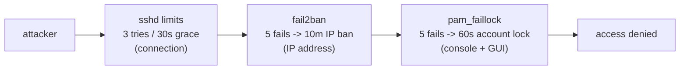
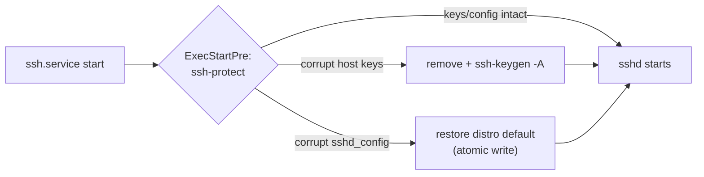

# 8. Always-On Image Hardening

Every image ships with two build-time features that need no configuration:
the [security-hardening profile](#2-security-hardening-profile) (brute-force
and attack-surface reduction) and
[ssh-protect](#3-ssh-protect--ssh-power-loss-recovery) (power-loss repair).
Both are applied unconditionally by
[`seeed_armbian_extension.sh`](../seeed_armbian_extension.sh) — there is no
flag to forget.

1. [Defense layers](#1-defense-layers)
2. [Security-hardening profile](#2-security-hardening-profile)
3. [ssh-protect — SSH power-loss recovery](#3-ssh-protect--ssh-power-loss-recovery)
4. [Verify on a running device](#4-verify-on-a-running-device)

## 1. Defense layers

An attacker knocking on SSH meets three independent barriers; console and
GUI logins meet the PAM lockout:



Each layer is configured at image build time
([`recomputer-security.sh`](../security-hardening/recomputer-security.sh))
and none of them requires a running agent beyond `fail2ban` itself.

## 2. Security-hardening profile

[`recomputer-security.sh`](../security-hardening/recomputer-security.sh)
applies all of the following into the image at build time:

| Feature | What it does | Source |
|---|---|---|
| sshd hardening | `LoginGraceTime 30`, `MaxAuthTries 3`, `MaxStartups 10:30:60` | [`:8-17`](../security-hardening/recomputer-security.sh#L8) |
| Terrapin mitigation | drops `chacha20-poly1305` and all `*-etm` MACs from the negotiated sets | same block |
| fail2ban sshd jail | 5 failed attempts within 10 min → 10 min IP ban; service enabled | [`:19-31`](../security-hardening/recomputer-security.sh#L19), [`:122-126`](../security-hardening/recomputer-security.sh#L122) |
| `pam_faillock` | 5 consecutive password failures lock the account for 60 s (console + GUI); injected into `common-auth`/`common-account` | [`:33-55`](../security-hardening/recomputer-security.sh#L33) |
| SSH PAM bypass | sshd skips `pam_faillock` on purpose — brute-force is handled at IP level by fail2ban, so a lockout can never lock out a legitimate SSH user | [`:57-63`](../security-hardening/recomputer-security.sh#L57) |
| SSH disabled by default | `ssh.service`/`ssh.socket` are disabled; enable after first local login (below) | [`:110-120`](../security-hardening/recomputer-security.sh#L110) |
| polkit setuid fallback | vendor 6.1 kernels lack `SO_PEERPIDFD`, which polkitd ≥ 127's socket-activated helper needs; the legacy setuid helper is restored and the socket disabled instead | [`:128-143`](../security-hardening/recomputer-security.sh#L128) |
| DHCP data minimization | `dhclient` requests only essential options; `systemd-networkd` uses link-layer DUIDs | [`:65-79`](../security-hardening/recomputer-security.sh#L65) |

A per-board summary of all of this is generated into the image at
`/usr/share/doc/seeed-security-hardening/README.md`
([`:81-108`](../security-hardening/recomputer-security.sh#L81)).

**Enable SSH (after first local login):**

```bash
sudo systemctl enable --now ssh
```

**Re-apply the polkit fallback after a polkitd package upgrade** (the mode
bit resets; GUI authorization prompts fail when it is missing):

```bash
sudo chmod 4755 /usr/lib/polkit-1/polkit-agent-helper-1
sudo systemctl disable --now polkit-agent-helper.socket
```

## 3. ssh-protect — SSH power-loss recovery

Power loss during the **first boot** can zero-fill or truncate `/etc/ssh`
files (ext4 delayed allocation); sshd then refuses to start and the board
is unreachable.

The fix ([`ssh-protect.sh`](../ssh-protect/ssh-protect.sh)): a systemd
drop-in runs
[`/usr/lib/armbian/ssh-protect`](../ssh-protect/rootfs/usr/lib/armbian/ssh-protect)
as `ExecStartPre` of `ssh.service`. It repairs, before sshd starts:

- broken host keys — missing/empty/unparseable keys are removed and
  regenerated (`ssh-keygen -A`);
- a broken `sshd_config` — restored from the distro default with the
  Armbian essentials re-applied, written atomically (temp file + rename +
  sync) so a power loss during the repair itself cannot corrupt it again.



Healthy systems: complete no-op. Nothing to configure.

## 4. Verify on a running device

```bash
systemctl is-enabled fail2ban          # enabled
systemctl is-enabled ssh               # disabled (until you enable it)
sudo sshd -T | grep -E 'logingracetime|maxauthtries'   # 30 / 3
faillock --user <name>                 # PAM lockout state
cat /usr/share/doc/seeed-security-hardening/README.md  # on-image summary
```
